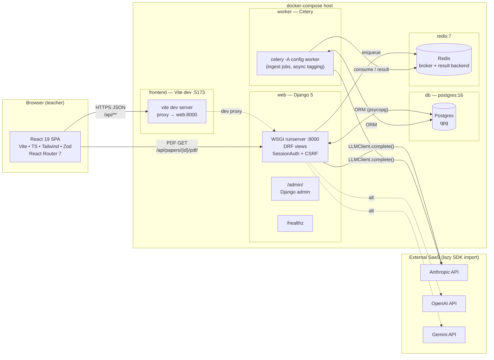
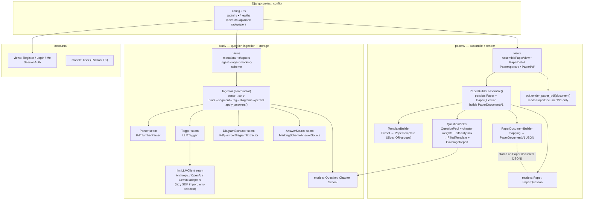
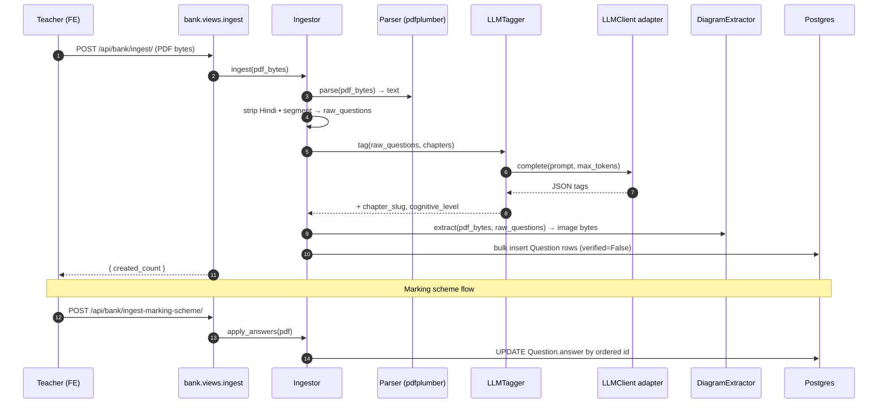
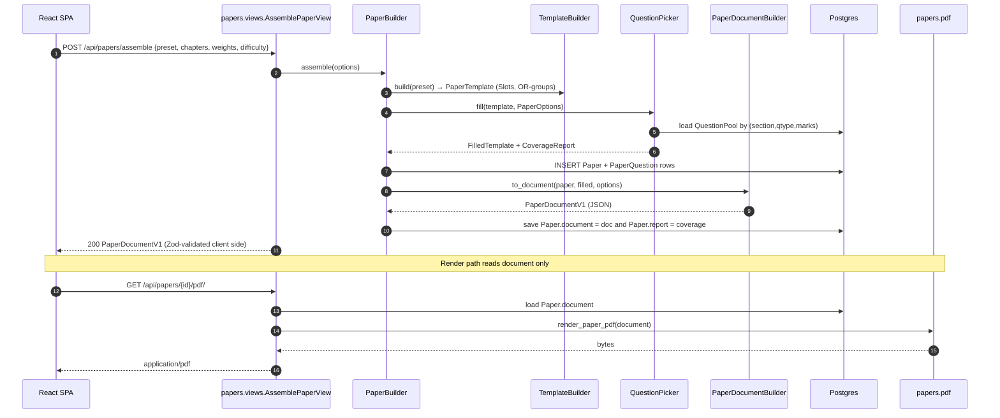
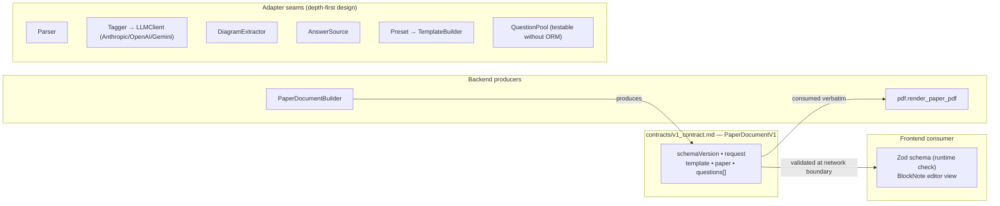

# Architecture Diagrams

Technical diagrams of the QS Paper Generator system, rendered with Mermaid.

> **How to view**
> - **GitHub**: renders Mermaid in `.md` files natively — open this file on github.com.
> - **VS Code**: install the [Markdown Preview Mermaid Support](https://marketplace.visualstudio.com/items?itemName=bierner.markdown-mermaid) extension, then open this file and press `Cmd+Shift+V` (macOS) / `Ctrl+Shift+V` to preview.
> - **CLI / export**: `npx @mermaid-js/mermaid-cli -i docs/architecture-diagrams.md -o out.png` to export.

---

## 1. Process boundaries & runtime topology

---

## 2. Django app seams (process-internal modules)

---

## 3. Ingestion data flow (question bank build)

---

## 4. Paper assemble + render flow

---

## 5. Contract & extensibility seams

---

## Key invariants

- **Single render contract**: `Paper.document` (PaperDocumentV1) is the only thing the PDF renderer and FE editor read. `PaperQuestion` rows are an assembly snapshot for analytics, not a render input.
- **Process isolation**: `web` (sync DRF) and `worker` (Celery) share Postgres + Redis only; no in-process state.
- **LLM provider swap**: env `LLM_PROVIDER` selects adapter; SDKs imported lazily so unused providers add zero import cost.
- **Four ingestion seams** (`Parser` / `Tagger` / `DiagramExtractor` / `AnswerSource`) let tests inject stubs without PDF I/O or network.
- **Auth**: Django SessionAuth + CSRF; multi-tenant `School` FK present but passive in Slice 1.
